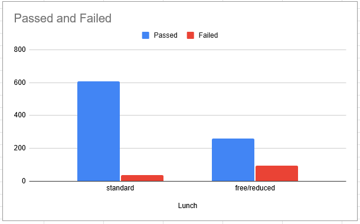
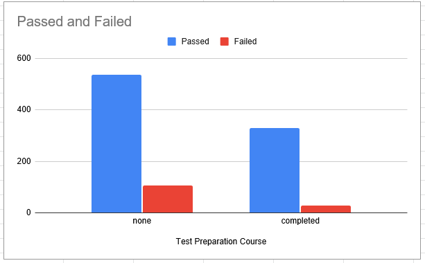

# Spark DataFrame Task
This goal of this project is to learn more about Spark's DataFrames, and SparkSQL APIs. The project is written in Scala.

## Table of Contents
* [Introduction](#intro)
* [Technologies](#technologies)
* [Dataset Used](#dataset)
* [Analysis Types](#analysis)
	* [Attributes Impact](#analysis-attr-impact)
	* [Other Mathematical Analysis](#analysis-mathematical-analysis)
* [SparkSQL](#spark-sql)
* [Working With Parquet Files](#parquet-files)
	* [Difference between CSV and Parquet Approaches](#parquet-files-csv-vs-parquet)
* [Setup](#setup)
* [License](#license)

<a name="intro"></a>
## Introduction
This project was my implementation to a given task, where I should apply some operations to analyse the data, and get more information about the nature of the dataset used. In my analysis, I've applied to approaches. The first approach, probably is not the most correct way to analyse a dataset, where I apply some queries on the dataset to get a picture of the contribution of each attribute. The second approach, is to get top/last 10 students, apply some sum (), count (), and avg () functions on the dataset and show the output on the terminal.

Also, I've worked with SparkSQL as well. I've learnt how to apply SQL queries on the loaded dataset directly from SparkSQL, which is another way of applying queries using the DataFrame APIs.

The project mainly contains two scala scripts. The first one which is "WorkingWithCSV.scala" file, contains the analysis, DataFrame preprocessing, and applying custom schema to the DataFrame.

The second one, which is name as "WorkingWithParquet.scala" is a script where I learnt how to interact and work with Hive Tables, and how to read a Hive Table stored as Parquet format.

In this README.md file, I'll try to quickly go through the two scripts, as descrbied in the Table of Contents above. Also I'll try to show some snippets along with their output.

<a name="technologies"></a>
## Technologies
* Spark Version: 2.4.5
* Scala Version: 2.11.12

<a name="dataset"></a>
## Dataset
Dataset used represents the data of 1000 students, it mainly contains some students attributes and their performance in 3 exams, math, reading, and writing exams. Attributes included in the data file are their gender, race/ethnicity, parental level of education, whether they ate their standard lunch meal, and whether they took their test preparation course. The full dataset and its description are on kaggle .

<a name="analysis"></a>
## Analysis
In my analysis, I wanted to see how each attribute can impact the data, and by how much each attribute can contribute to the score of the students. So I decided to focus only on the "math score" results to do my analysis on. However, this may not be the correct way to do the analysis, a more correct way is to, for example, compare the percentage of passed female students out of all the female students to the passed male students out of all the male students rather than comparing the passed female to the passed male students out of all students.

I also applied some mathematical analysis on the data using both DataFrame APIs as well as SparkSQL as we shall see in the rest of the document.

<a name="analysis-attr-impact"></a>
### Attribute Impact
I'm only going to list code snippets and their output to some of the attributes, rest of the implementation are the same except applied on the rest of the attributes. In this approach, I didn't care much about the exact score, I only wanted to see whether or not a student would pass the exam.

#### Lunch
* code
```
    // Relation between Lunch and Math Performance
    val studentsGroupedByLunch = studentsPerformanceDF
      .select (studentsPerformanceDF ("math score") >= 50, studentsPerformanceDF ("lunch"))
      .groupBy ("lunch", "(math score >= 50)")
      .count ()
 
    studentsGroupedByLunch.write.csv ("StudentsGroupedByLunch.csv")
    studentsGroupedByLunch.show ()
    computeEachGroupPercentage (studentsGroupedByLunch, totalNumberOfStudents)
``` 

* terminal output
```
+------------+------------------+-----+
|       lunch|(math score >= 50)|count|
+------------+------------------+-----+
|    standard|             false|   39|
|free/reduced|             false|   96|
|    standard|              true|  606|
|free/reduced|              true|  259|
+------------+------------------+-----+

Percentage of standard ^ false is: 0.039
Percentage of free/reduced ^ false is: 0.096
Percentage of standard ^ true is: 0.606
Percentage of free/reduced ^ true is: 0.259
```

* graph


#### Test Preparation Course
* code
```
    val studentsGroupedByTestPrep = studentsPerformanceDF
      .select (studentsPerformanceDF ("test preparation course"), studentsPerformanceDF ("math score") >= 50)
      .groupBy ("test preparation course", "(math score >= 50)")
      .count ()
 
    studentsGroupedByTestPrep.write.csv ("StudentsGroupedByTestPrep.csv")
    studentsGroupedByTestPrep.show ()
    computeEachGroupPercentage (studentsGroupedByTestPrep, totalNumberOfStudents)
```

* terminal output
```
+-----------------------+------------------+-----+
|test preparation course|(math score >= 50)|count|
+-----------------------+------------------+-----+
|                   none|             false|  107|
|              completed|             false|   28|
|              completed|              true|  330|
|                   none|              true|  535|
+-----------------------+------------------+-----+

Percentage of none ^ false is: 0.107
Percentage of completed ^ false is: 0.028
Percentage of completed ^ true is: 0.33
Percentage of none ^ true is: 0.535
```

* graph



<a name="analysis-mathematical-analysis"></a>
### Other Mathematical Analysis

* Top 10 Students
```
+------+--------------+---------------------------+------------+-----------------------+----------+-------------+-------------+
|gender|race/ethnicity|parental level of education|       lunch|test preparation course|math score|reading score|writing score|
+------+--------------+---------------------------+------------+-----------------------+----------+-------------+-------------+
|  male|       group E|         associate's degree|free/reduced|              completed|       100|          100|           93|
|female|       group E|               some college|    standard|                   none|       100|           92|           97|
|female|       group E|          bachelor's degree|    standard|                   none|       100|          100|          100|
|  male|       group A|               some college|    standard|              completed|       100|           96|           86|
|  male|       group D|               some college|    standard|              completed|       100|           97|           99|
|  male|       group E|          bachelor's degree|    standard|              completed|       100|          100|          100|
|female|       group E|         associate's degree|    standard|                   none|       100|          100|          100|
|female|       group E|                high school|    standard|                   none|        99|           93|           90|
|female|       group E|          bachelor's degree|    standard|              completed|        99|          100|          100|
|  male|       group E|               some college|    standard|              completed|        99|           87|           81|
+------+--------------+---------------------------+------------+-----------------------+----------+-------------+-------------+
```

* average score in math
```
Average of math score between students: 66.089
```

<a name="spark-sql"></a>
## SparkSQL
We've used SparkSQL as well to apply analysis queries on the data, as an example of these queries we've applied a query to retrieve the top 3 students from each parental level of education using the "OVER" and "PARTITION BY" Clauses.

There is no difference between applying SQL queries using SparkSQL or the DataFrame APIs, the same level of optimization provided by Spark gets applied on both of them.

Here's a simple example from one our implemented queries to retrieve the top 3 students who scored in math more than in reading but less than in writing

```
spark.sql ("SELECT * FROM students WHERE math_score > reading_score AND math_score < writing_score ORDER BY math_score DESC LIMIT 3").show ()
```

<a name="parquet-files"></a>
## Working With Parquet Files
In the second scala script "WorkingWithParquet.scala" it contains saving and loading data into a Hive Table stored as Parquet format. Rest of the code in this files is just the same analysis query that we've applied in the "WorkingWithCSV.scala" file.

<a name="parquet-files-csv-vs-parquet"></a>
### Difference Between CSV and Parquet Approaches
#### Regarding the Code and the Results
There was no difference between the two approaches since they're both get loaded into a DataFrame and we apply our queries through either the DataFrame APIs, or the SparkSQL API without caring much about the format of the data we loaded.

The results of all the queries were the same as well.

#### Regarding the Performance
In my case, the dataset used was small, so there was no significant difference between the two approaches. But, the Parquet format should be faster in analytical queries (queries interested in only sepecifc columns like the described above) since it's column-based storage.

<a name="setup"></a>
## Setup
You can either open the project using IntelliJ, or execute the project from the attached .jar file using spark-submit command and specifying which script to run. The .jar file is in `target/scala-2.11/`

```
spark-submit --class WorkingWithCSV spark-task.jar
```

<a name="license"></a>
## License
This project is licensed under the GNU Generap Public License v3.0
